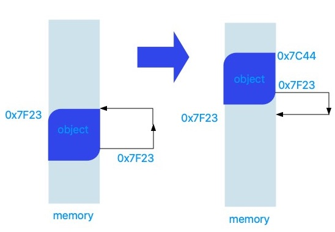
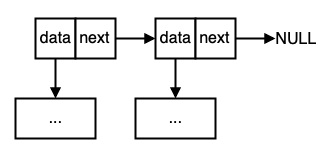
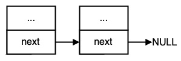
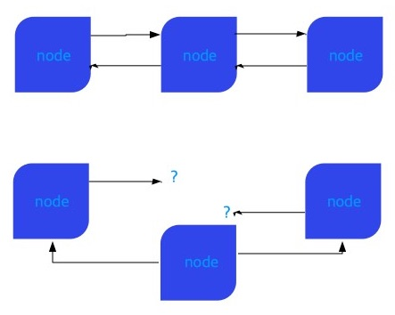

Let's use the Pin.

In Rust, `pin` is a property that prevents the memory location of an object from being relocated.
The most common case where this feature is needed is when a member variable of a struct refers to itself.
In this case, if the object of the struct is relocated, the value of the member variable will have a meaningless value,
This will have unpredictable results.

The following figure shows an example of how the contents in memory are displayed when an object is relocated.



Here, at first, the member variable in the object points exactly to the starting position of the object, 0x7F23.
If this object is relocated to an arbitrary location, 0x7C44, the member variable in the object still points to 0x7F23. If this happens, the operation using this object will be unpredictable.
If you're not lucky, the process will panic.

If you want to prevent such misfortune, you can `pin` this object and prohibit relocation of the object.

Rust supports this feature by providing the `std :: pin` module. Some `Pin<P>` are objects of pointer type P that are fixed in memory.
It occupies and keeps its position until it is dropped.
In Rust, basically all types are portable. In other words, you can move an object of a type to another variable by-value.
When the ownership of an object is moved from one variable to another, the object can be relocated.
`Pin<P>` is a type surrounding a pointer, you can use `Pin<Box <T>>` like `Box<T>` and similarly `Pin<&mut T>`
can be used as `& mut T`. However, pinned data itself is not allowed. This means that functions like `mem::swap`
prevents attempts to relocate objects by accessing pinned data.

```rust
use std::pin::Pin;

struct SomeStruct {
    a: i32,
    b: i32
}

fn main() {
    let mut s1 = SomeStruct { a: 1, b: 2 };
    let mut s2 = SomeStruct { a: 1, b: 3 };
    let p1 = Pin::new(&mut s1);
    let p2 = Pin::new(&mut s2);
    swap_pinned_data(p1, p2);
}

fn swap_pinned_data<T>(x: Pin<&mut T>, y: Pin<&mut T>) {
    std::mem::swap(&mut *x, &mut *y);
}
```

The above code attempts to relocate the pinned object. In this case, the Rust compiler outputs the following error message.
This is not allowed.

```rust
error[E0596]: cannot borrow data in a dereference of `std::pin::Pin<&mut T>` as mutable
  --> src/main.rs:17:20
   |
17 |     std::mem::swap(&mut *x, &mut *y);
   |                    ^^^^^^^ cannot borrow as mutable
   |
   = help: trait `DerefMut` is required to modify through a dereference, but it is not implemented for `std::pin::Pin<&mut T>`
```

As you can see from the code above, the Rust compiler does not allow &mut T access to Pinned Type T which can cause the value of T to be changed.
It does not allow mutable borrowing.

Rust provides a basic trait called `Unpin`. This trait is automatically implemented in Rust's primitive types bool, i32, f64, etc.
Even if this basic type is pinned, memory relocation is allowed by applying the Unpin trait. These basic types of objects does not refer to the memory location of themselves so, even if it is moved, it does not harm the integrity of the system.

The following is an example of using the pin from [Rust Reference](https://doc.rust-lang.org/std/pin/index.html).

```rust
use std::pin::Pin;
use std::marker::PhantomPinned;
use std::ptr::NonNull;

// This is a self-referential struct because the slice field points to the data field.
// We cannot inform the compiler about that with a normal reference,
// as this pattern cannot be described with the usual borrowing rules.
// Instead we use a raw pointer, though one which is known not to be null,
// as we know it's pointing at the string.
struct Unmovable {
    data: String,
    slice: NonNull<String>,
    _pin: PhantomPinned,
}

impl Unmovable {
    // To ensure the data doesn't move when the function returns,
    // we place it in the heap where it will stay for the lifetime of the object,
    // and the only way to access it would be through a pointer to it.
    fn new(data: String) -> Pin<Box<Self>> {
        let res = Unmovable {
            data,
            // we only create the pointer once the data is in place
            // otherwise it will have already moved before we even started
            slice: NonNull::dangling(),
            _pin: PhantomPinned,
        };
        let mut boxed = Box::pin(res);

        let slice = NonNull::from(&boxed.data);
        // we know this is safe because modifying a field doesn't move the whole struct
        unsafe {
            let mut_ref: Pin<&mut Self> = Pin::as_mut(&mut boxed);
            Pin::get_unchecked_mut(mut_ref).slice = slice;
        }
        boxed
    }
}

let unmoved = Unmovable::new("hello".to_string());
// The pointer should point to the correct location,
// so long as the struct hasn't moved.
// Meanwhile, we are free to move the pointer around.
let mut still_unmoved = unmoved;
assert_eq!(still_unmoved.slice, NonNull::from(&still_unmoved.data));

// Since our type doesn't implement Unpin, this will fail to compile:
// let mut new_unmoved = Unmovable::new("world".to_string());
// std::mem::swap(&mut *still_unmoved, &mut *new_unmoved);
```

#### Intrusive doubly-linked list

Let's take a look at the remaining interests related to Pin while dealing with an intrusive doubly-linked list.

Let's start with what is an intrusive linked list.

The general linked list is as follows.



This approach requires expensive heap memory allocation twice. Also, the creation, addition, and deletion of nodes becomes more complicated.

A more efficient intrusive linked list has data as a pointer and does not store actual data separately.
Refers to something inherent in a list element.



As shown in the figure, the memory space for data is not allocated separately, and the data of the node and the link pointer exist together in one space.
In the intrusive doubly-linked list, the next and prev pointers should point to pinned nodes. If the position of the node moves,
the link pointers of the node will point to a pointless location.



In the figure above, when the position of the middle node is rearranged, you can see the situation where two pointers have meaningless values.
Even if the relocation of the node is blocked using pins, the problem still exists.
In Rust, the release of an object depends on Drop. If a node in the list is released by simply releasing that node,
the linked list will be disconnected. Therefore, pinning must be discussed with drop assurance.

### Drop Guarantee

Pinned data is reused after it is dropped. And protected at the Rust system level to prevent it from moving. Invalidation of memory occurs not only by freeing memory, but also by replacing Some(v) with None, or subtracting an element from a vector. Data can be reused without releasing data by using `ptr::write`.
Drop guarantee means to ensure that the release of a node from the aforementioned linked list makes the list still work. Also note that this guarantee does not mean preventing memory leaks. Memory leaks are another caveat and are not related to drop. In order to safely drop a node from the linked list above, the user must implement a drop manually.

When using a pinned data structure, be very careful with the drop. The `drop` function receives `&mut self`, and so is the case with pinned data. In other words, in the case of pinned data, unsafe code is called to extract `&mut self` and this will pass the responsibility of not moving the data to the user. The implementation example of Drop is as follows.
It is from https://doc.rust-lang.org/std/pin/index.html

```rust
impl Drop for Type {
    fn drop(&mut self) {
        // `new_unchecked` is okay because we know this value is never used
        // again after being dropped.
        inner_drop(unsafe { Pin::new_unchecked(self)});
        fn inner_drop(this: Pin<&mut Type>) {
            // Actual drop code goes here.
        }
    }
}
```

Here, the `new_unchecked` function is unsafe, and the user is responsible for not relocating or invalidating the data. This function returns a pointer to a pinned object for an object. The reason for this step is that we have to follow the signature of the drop function of the drop trait. The reason this function is safe is that it creates a pinned pointer and frees the object immediately, so it is guaranteed not to be relocated or invalidated. If `#[repr(packed)]` is used, the compiler automatically inserts code that adjusts the layout. Therefore, `#[repr(packed)]` cannot be used with pins.
Let's take a look at how to access the fields of the structure when using the Pinned structure, that is, when you have a Pin<&mut Struct> in the most common way, a method called projection is used to write a helper function, which takes a Pin<&mut Struct> and returns a reference to a specific field. Here, the type of the reference may be Pin<&mut Field> (including the case of `Pin<& Field>`) or `&mut Field` (including the case of `& Field`). It is up to the user to decide which type to return, but there are some limitations, and the most important one is `consistency`. Any field can be projected as a reference or a pinned reference. It is not good to write code in which some fields are pins and other fields are pins removed. As the designer of the data structure, the user can decide whether or not to propagate the pin, and the propagation case is said to be "structural". This is because the projection of this data structure follows the structure of the original data structure.

### Pinning is not "structural"

If the field of the pinned structure is not pinned, it is actually the easiest option, and in this case, it will not be a problem unless another `Pin<&mut Field>` is created. In other words, while allowing relocation, you must do something to prohibit relocation. Therefore, the only thing to be careful about when a user does a non-pin projection is not to make a `Pin<&mut Fiend>`. An example of such projection is shown below.

```rust
impl Struct {
    fn pin_get_field(self: Pin<&mut Self>) -> &mut Field {
        // This is okay because `field` is never considered pinned.
        unsafe { &mut self.get_unchecked_mut().field }
    }
}
```

Users are allowed to write `impl Unpin for Struct` even if the corresponding `Field` is not Unpin. The reason is that it is safe to implement Struct's Unpin that contains Field which is not Unpin, because `Pin<&mut Field>` will never be created.

### Pinning is "structural"

In this case, the Struct is not relocatable and the fields in the structure are also not relocatable. In other words, this projection makes `Pin<&mut Field>`. Below is an example of such code.

```rust
impl Struct {
    fn pin_get_field(self: Pin<&mut Self>) -> Pin<&mut Field> {
        // This is okay because `field` is pinned when `self` is.
        unsafe { self.map_unchecked_mut(|s| &mut s.field) }
    }
}
```

However, there are some additional requirements in this case.

1. If all structural fields are Unpin, the structure is automatically Unpin, and only in this case. That is, structures that are not automatically Unpin should not be manually made into Unpin through an implementation such as `impl<T> Unpin for Struct<T>`. It should be borne in mind that Unpin is safe here. Projection uses unsafe code, but Unpin is safe, so you don't have to worry about the safety of unpin while using pin and unsafe.

2. The destructor of the structure must not move the structural field. The drop takes `&mut self` as an argument, so the risk of repositioning this argument is open at any time. However, since structures and fields are pinned, a system mismatch occurs when such a relocation operation occurs in the drop function. `#[repr(packed)]` also causes automatic relocation of data and should not be used with pins.

3. If the structure is pinned, the structure must have drop guarantee. In other words, the contents of a pinned structure must not be released or overwritten until it is dropped. This meaning is a bit tricky, because in the case of `VecDeque <T>`, if any element fails in the process of releasing all elements, it fails to release the remaining elements. In this case, drop guarantees are compromised, because a failed call to VecDeque can release an element without calling drop on one or more elements.

4. The user should not provide any function to pull out the contents of the pinned structure. This is because it can result in moving the structure contents. For a simple example, if a struct has a field with the value Option<T> and you define a function like `fn(Pin<&mut Struct<T>>)-> Option<T>`, this function fetches the value which can be moved. For a more crowded example, the code is shown below.

```rust
fn exploit_ref_cell<T>(rc: Pin<&mut RefCell<T>>) {
    { let p = rc.as_mut().get_pin_mut(); } // Here we get pinned access to the `T`.
    let rc_shr: &RefCell<T> = rc.into_ref().get_ref();
    let b = rc_shr.borrow_mut();
    let content = &mut *b; // And here we have `&mut T` to the same data.
}
```

The above function is the code to move the pinned data, and executing this code will be a disaster.

Thanks for reading.
